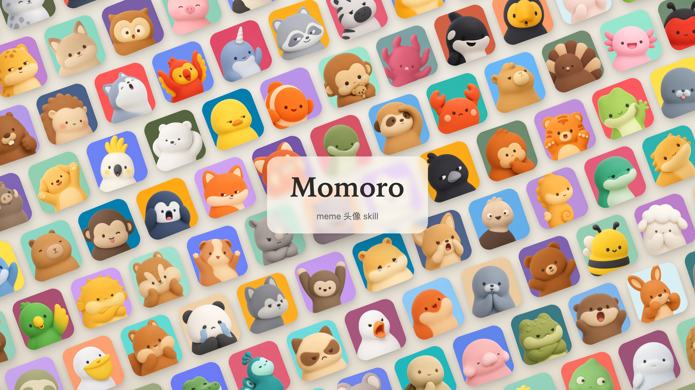
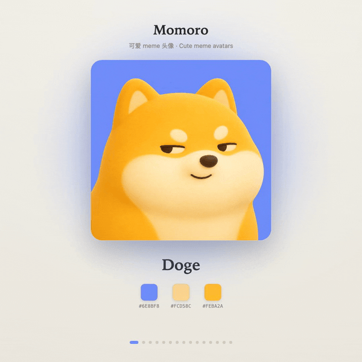
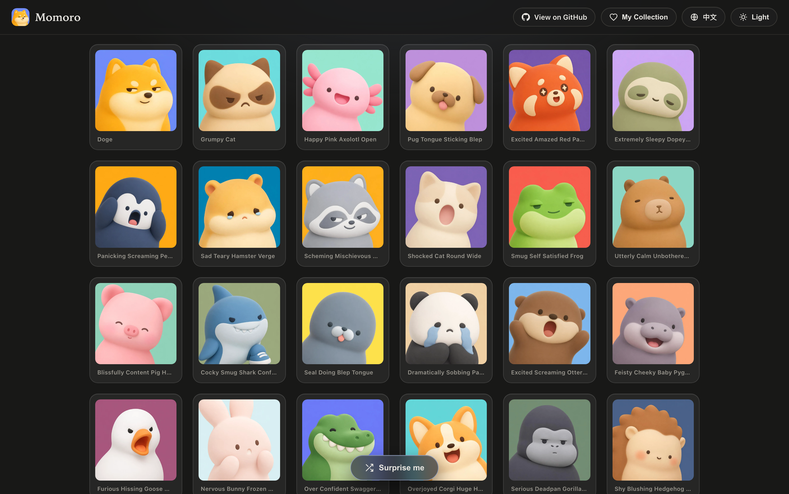

# Momoro

A skill for generating **extremely simple, cute, personified square mascot avatars** — one rounded chunky character, two character colors on one contrasting background, readable even at 32×32 — plus **Momoro**, a gallery of 124 ready-made clay-style meme-flavored mascots.





## What's in here

- **`SKILL.md`** — the mascot skill: art-direction rules, a prompt skeleton, and a workflow an agent can follow to propose directions and produce candidates.
- **`generate_mascot.py`** — a zero-dependency bundled generator (calls an OpenRouter-hosted image model) for when no agent-native image tool is available.
- **`palettes.json`** — a curated set of bright, contrasting background colors used by the generator's `--palette contrast` mode.
- **`site/`** — **Momoro**, a self-contained dark-theme gallery of 124 mascots (search, categories, favorites, lightbox, EN/中文, one-click PNG download). No build step, no backend.

## The skill

Momoro produces the *simplest possible* lovable mascot: a compact symbol that still reads at tiny sizes, not a detailed illustration. It works two ways:

1. **Agent-native image tool** — send the prompt from the skeleton in `SKILL.md` to whatever image model the agent has.
2. **Bundled generator** — no native tool needed:

   ```bash
   cp .env.example .env      # then paste your OpenRouter key into .env
   python3 generate_mascot.py --subject "rounded owl" --count 6
   # or drive the palette automatically:
   python3 generate_mascot.py --subject "chubby fox" --ip1 "#FF6B35" --ip2 "#FFE0C2" --palette contrast --count 6
   ```

   Each candidate is saved as its own PNG in `output/`, alongside an HTML preview page. Full rules and options live in [`SKILL.md`](SKILL.md).

### Configure the API key

The generator reads `OPENROUTER_API_KEY` from the environment or a local `.env` (git-ignored).

- Get a key at <https://openrouter.ai/keys> (format `sk-or-v1-...`).
- Copy `.env.example` → `.env` and paste it in, or `export OPENROUTER_API_KEY=...`.
- Optional: `OPENROUTER_IMAGE_MODEL` to pick the image model, `IMAGE_PROXY` if the model is region-locked for you.

No other dependencies — `generate_mascot.py` is pure Python 3 standard library.

## The Momoro gallery



A plain static site in `site/`. Run it locally:

```bash
cd site
python3 -m http.server 8123
# open http://127.0.0.1:8123/
```

Deploy anywhere static (GitHub Pages, Cloudflare Pages, Netlify, Vercel, or any object storage + CDN) — it's just files. See [`site/README.md`](site/README.md) for details.

## Notes

The mascots are original, AI-generated characters in a consistent clay style. Names (e.g. "Doge", "Grumpy Cat") are **descriptive references to internet culture** for discoverability, not claims of ownership; the underlying meme characters may be subject to their own trademarks or copyrights. Use the generated art thoughtfully and check the rights of any specific character before commercial use.
